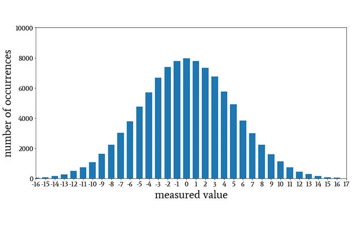

# Trending YouTube Video Statistics

YouTube maintains a list of the top trending videos. YouTube uses a combination of factors to determine what the top videos are including measuring number of views, shares, comments and likes, while top videos are not necessarily the most-viewed videos overall. Top performers on the YouTube trending list are music videos, reality TV, and homemade videos that go viral for inexplicable reasons.

## Table of Contents
1. [Dataset](#dataset)
2. [Exploratory data analysis](#eda)
2. [Future Directions](#future-directions)

## Dataset

This dataset is a daily record of the top trending YouTube videos between November 2017 and May 2018. Data is included for the US, GB, DE, CA, FR, RU, MX, KR, JP and IN regions (USA, Great Britain, Germany, Canada, France, Russia, Mexico, South Korea, Japan and India respectively), with up to 200 listed trending videos per day. Each country has about 40,000 entries total.https://github.com/sborodach/central-limit-theorem.git

Each region’s data is in a separate file. Data includes the video title, channel title, publish time, tags, views, likes and dislikes, description, and comment count.

The data also includes a category_id field, which varies between regions. To retrieve the categories for a specific video, it must be found in the associated JSON. One such file is included for each region in the dataset.

This dataset was collected using the YouTube API.

  
<b>Figure 1: </b> This is a normal distribution.    

### Exploratory data analysis

1. What is the like ratio comparison between US and Mexico?
H0: No difference between mean ratio.
H1: The mean ratios are unequal

2. What is the like ratio January and December for Russia?
H0: No difference between mean ratio.
H1: The mean ratios are unequal

3. Do comments per view differ between US and Mexico?
H0: No difference between mean ratio.
H1: The mean ratios are unequal

### 1. What is the like ratio comparison between US and Germany?

Like ratio: likes / (likes + dislikes)

A measure of sentiment for trending videos. We know this number will be high because these are popular videos but we want to see if the average sentiment for trending videos is higher in the Unites States than in Germany. Perhaps this metric could be viewed as a measure of consensus and solidarity in opionions wihin each country, or a willingness to express an unpopular opinion (dislike) if the ratio is lower.

H0: No difference between mean like ratio between germany and the United States.
H1: The mean like ratios are unequal.

### 2. What is the comment ratio comparison between US and Mexico?

Comment ratio: comments / views

A measure of engagement for trending videos. We know this number will be low beause most people don't comment.

H0: No difference between mean like ratio between germany and the United States.
H1: The mean like ratios are unequal.

## Challenges

1. Working with many files: merging 10 .csv files and 10 .json files into an easy to use format

2. Using GitHub to keep everyone working on the same file.

3. Wrangling user-generated data such as tags and titles into a format suitable for plotting and modeling.
